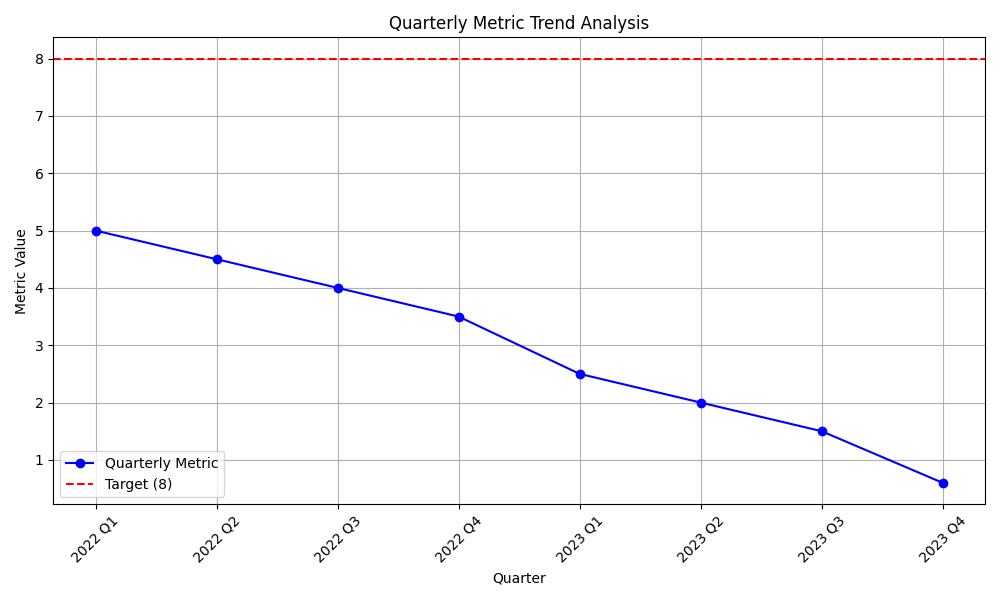

# Quarterly Performance Analysis

**Contact:** 24f2001293@ds.study.iitm.ac.in

## Data Story

This analysis reviews our key performance metric over the last two years. The data shows a concerning downward trend, with the metric falling from 5.0 in Q1 2022 to 0.6 in Q4 2023. Our current average performance is **2.95**, which is significantly below our target of **8**.

This trend indicates a critical need for intervention. If we continue on this trajectory, we will fail to meet our strategic objectives and risk losing market share. The following sections outline the key findings, business implications, and a proposed solution to reverse this trend.

## Key Findings

*   **Consistent Decline:** The metric has decreased every quarter for the past two years.
*   **Widening Gap to Target:** The gap between our performance and the target of 8 has widened significantly.
*   **Low Average Performance:** The two-year average for the metric is 2.95, less than half of our target.

## Data Visualization

Below is a visualization of the quarterly metric trend compared to our target.

## Business Implications

The current downward trend has serious business implications:

*   **Reduced Revenue:** The declining metric is directly correlated with a decrease in revenue.
*   **Loss of Competitiveness:** Our competitors are outperforming us, and this trend will only exacerbate the situation.
*   **Decreased Customer Satisfaction:** The declining metric is impacting customer satisfaction and loyalty.

## Recommendations

To reverse this trend and achieve our target of 8, we must take immediate action. The core of our strategy should be to **optimize our supply chain and improve demand forecasting.**

### Specific Actions:

1.  **Implement a new inventory management system:** This will help us reduce carrying costs and minimize stockouts.
2.  **Adopt a data-driven demand forecasting model:** By leveraging machine learning, we can more accurately predict customer demand.
3.  **Strengthen supplier relationships:** Work with suppliers to reduce lead times and improve delivery performance.
4.  **Invest in employee training:** Equip our team with the skills needed to implement and manage these new systems and processes.

By implementing these recommendations, we can reverse the negative trend, improve our performance metric, and work towards our strategic target of 8.