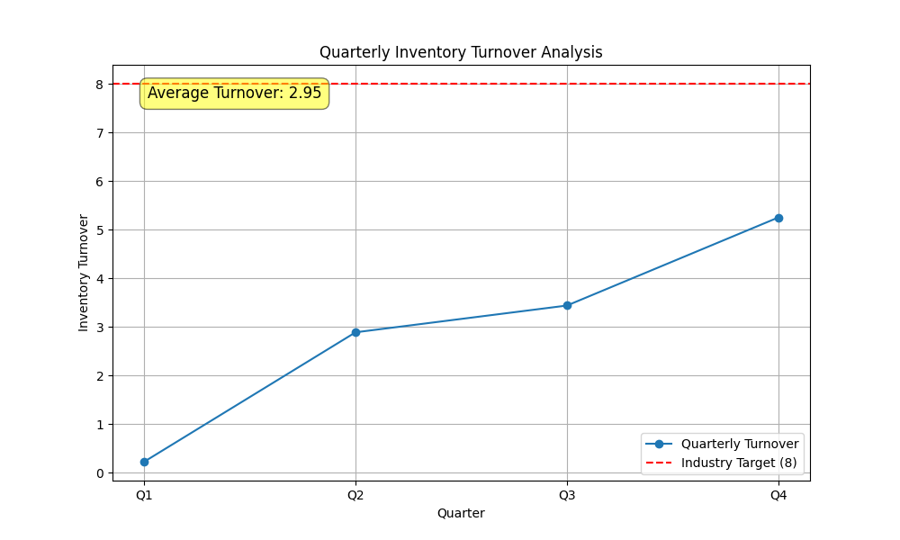

# Inventory Turnover Analysis

**Contact:** 24f2001293@ds.study.iitm.ac.in

## Data Story

This analysis reviews the inventory turnover for the last four quarters. The data shows a significant upward trend, starting from a low of 0.23 in Q1 and reaching 5.25 in Q4. While this shows positive momentum, the average turnover is **2.95**, which is still well below the industry target of **8**.

This analysis highlights both an opportunity and a challenge. The positive trend suggests that recent strategies may be working, but the gap to the industry target indicates that more needs to be done to optimize our supply chain and inventory management.

## Key Findings

*   **Positive Trend:** Inventory turnover has increased significantly throughout the year.
*   **Below Target:** Despite the improvement, the average turnover of 2.95 is significantly below the industry target of 8.
*   **Q4 Peak:** The fourth quarter showed the strongest performance, which could be due to seasonal demand or successful implementation of new strategies.

## Data Visualization

Below is a visualization of the quarterly inventory turnover compared to the industry target.

## Business Implications

The current inventory turnover rate has several business implications:

*   **Tied-up Capital:** A low turnover rate means that capital is tied up in inventory for longer periods, which could be used for other investments.
*   **Risk of Obsolescence:** Holding inventory for too long increases the risk of it becoming obsolete, leading to write-offs.
*   **Missed Sales Opportunities:** While the trend is positive, the overall low turnover rate suggests that we may not be meeting customer demand as efficiently as possible.

## Recommendations

To build on the positive momentum and reach the industry target of 8, the following recommendations should be considered:

### Specific Actions:

1.  **Enhance Demand Forecasting:** Implement more sophisticated demand forecasting models to better predict customer needs and optimize inventory levels.
2.  **Improve Supplier Collaboration:** Work more closely with suppliers to reduce lead times and improve the reliability of the supply chain.
3.  **Implement a Tiered Inventory Strategy:** Classify inventory items based on their value and turnover rate to apply different management strategies to each category.
4.  **Leverage Technology:** Utilize an advanced inventory management system to gain real-time visibility into inventory levels and automate reordering processes.

By implementing these recommendations, we can continue the positive trend, improve our inventory turnover, and work towards our strategic target of 8.
