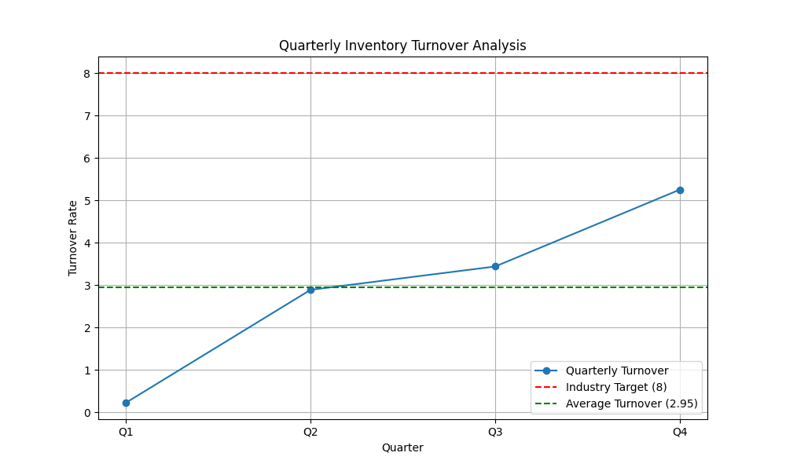

# Inventory Turnover Analysis

**Email for Verification:** 24f2001293@ds.study.iitm.ac.in

## Executive Summary

This report analyzes the company's inventory turnover for the past four quarters. The analysis reveals a significant gap between our current performance and the industry target. Our average inventory turnover is 2.95, while the industry benchmark is 8. This indicates that our inventory is not being sold and replenished as efficiently as our competitors, leading to increased holding costs and potential obsolescence. The solution lies in a comprehensive strategy to **optimize our supply chain and demand forecasting**.

## Key Findings

*   **Quarterly Trend:** The inventory turnover has shown a positive upward trend throughout the year, starting from a low of 0.23 in Q1 and reaching 5.25 in Q4.
*   **Average Turnover:** The average turnover for the year is 2.95.
*   **Performance Gap:** There is a substantial gap of 5.05 between our average turnover and the industry target of 8.
*   **Visualization:** The chart below illustrates the quarterly trend and the gap against the industry target.

## Business Implications

A low inventory turnover rate has several negative implications for the business:

*   **Increased Holding Costs:** Excess inventory ties up capital and incurs costs related to storage, insurance, and handling.
*   **Risk of Obsolescence:** Products that remain in inventory for extended periods are at a higher risk of becoming obsolete, leading to write-offs.
*   **Reduced Profitability:** The combination of high costs and potential revenue loss from obsolete stock directly impacts profitability.
*   **Inefficient Use of Capital:** Capital tied up in slow-moving inventory could be better invested in other areas of the business.

## Recommendations

To address the low inventory turnover and align with the industry target, we recommend the following actions focused on **optimizing the supply chain and demand forecasting**:

1.  **Enhance Demand Forecasting:**
    *   Implement advanced statistical models or machine learning algorithms to improve forecast accuracy.
    *   Incorporate external data sources (e.g., market trends, competitor analysis, economic indicators) into the forecasting process.
    *   Establish a collaborative forecasting process involving sales, marketing, and finance departments.

2.  **Optimize Inventory Management:**
    *   Adopt a just-in-time (JIT) inventory system to minimize the amount of stock held.
    *   Segment inventory using an ABC analysis to prioritize management efforts on high-value items.
    *   Set dynamic safety stock levels based on demand variability and lead times.

3.  **Improve Supply Chain Efficiency:**
    *   Strengthen relationships with suppliers to reduce lead times and improve reliability.
    *   Explore alternative sourcing options to increase flexibility and reduce dependence on single suppliers.
    *   Invest in technology to improve visibility across the supply chain, from raw materials to finished goods.

By implementing these recommendations, we can expect to see a significant improvement in our inventory turnover rate, leading to reduced costs, increased profitability, and a more agile and responsive supply chain.
