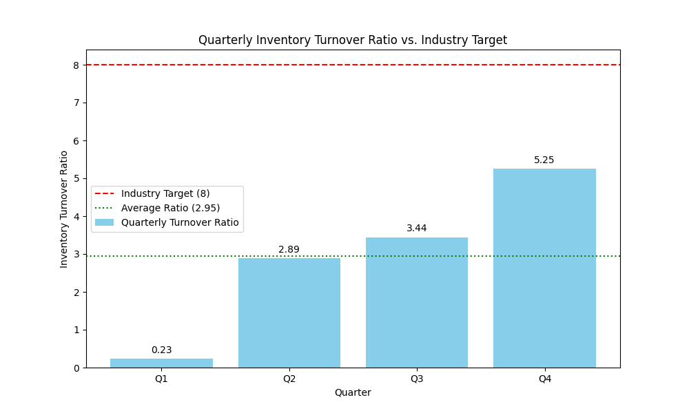

# Inventory Turnover Ratio Analysis

This report provides an analysis of the quarterly inventory turnover ratio for the year 2024.

**Contact:** 24f2001293@ds.study.iitm.ac.in

---

## Data Visualization

## Key Findings

- **Average Inventory Turnover Ratio:** The average inventory turnover ratio for 2024 is **2.95**.
- **Upward Trend:** There is a positive and steady upward trend in the inventory turnover ratio from Q1 (0.23) to Q4 (5.25). This indicates improving efficiency in managing inventory throughout the year.
- **Below Industry Target:** Despite the improvement, the average ratio of 2.95 is significantly below the industry target of 8. This suggests that there is still substantial room for improvement.

## Business Implications

The current trend has the following business implications:

- **High Holding Costs:** A low inventory turnover ratio suggests that capital is tied up in inventory for longer periods, leading to increased holding costs (storage, insurance, obsolescence).
- **Risk of Obsolete Inventory:** The longer inventory is held, the higher the risk of it becoming obsolete, especially in industries with short product life cycles.
- **Inefficient Supply Chain:** The ratio being below the industry benchmark points towards potential inefficiencies in the supply chain and demand forecasting processes.

## Recommendations

To improve the inventory turnover ratio and reach the industry target of 8, the following actions are recommended:

1.  **Optimize Supply Chain:**
    - **Improve Supplier Lead Times:** Work with suppliers to reduce lead times, which will allow for lower safety stock levels.
    - **Implement Just-In-Time (JIT) Inventory:** Adopt a JIT system to minimize the amount of inventory held.
    - **Enhance Warehouse Management:** Improve warehouse layout and processes to speed up the movement of goods.

2.  **Enhance Demand Forecasting:**
    - **Utilize Advanced Forecasting Tools:** Implement more sophisticated demand forecasting software to predict customer demand more accurately.
    - **Collaborate with Sales and Marketing:** Improve communication and collaboration between the supply chain, sales, and marketing teams to get better insights into future demand.
    - **Analyze Sales Data:** Regularly analyze historical sales data to identify trends and seasonality, which can help in making more accurate inventory decisions.
