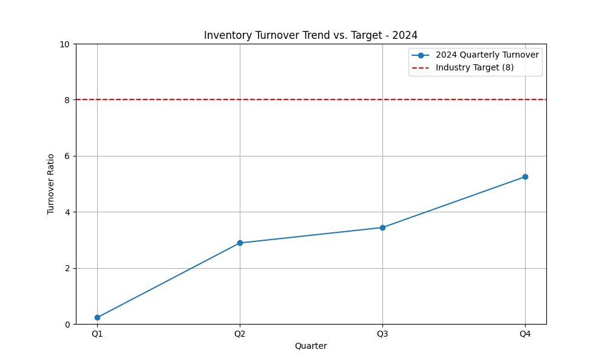

# Retail Performance Analysis - 2024 Inventory Turnover

**Contact:** 24f2001293@ds.study.iitm.ac.in

## Data Story

This analysis reviews our inventory turnover for 2024. The data shows a quarterly trend that, while improving, is still significantly below the industry target of 8. Our average turnover for the year is **2.95**.

This performance indicates a critical need for intervention. If we cannot improve our turnover rate, we will continue to face high carrying costs, reduced cash flow, and a competitive disadvantage. The following sections outline the key findings, business implications, and a proposed solution to address this issue.

## Key Findings

*   **Below Target Performance:** The average inventory turnover for 2024 is 2.95, which is far from the industry target of 8.
*   **Positive but Insufficient Trend:** While there is an upward trend from Q1 to Q4, the growth is not enough to reach our strategic goals.
*   **Widening Gap to Target:** The gap between our performance and the target remains significant throughout the year.

## Data Visualization

Below is a visualization of the quarterly inventory turnover trend compared to our target.

## Business Implications

The current turnover rate has several negative business implications:

*   **High Carrying Costs:** Excess inventory leads to increased storage, insurance, and obsolescence costs.
*   **Reduced Cash Flow:** Capital is tied up in inventory, limiting our ability to invest in other areas of the business.
*   **Loss of Competitiveness:** A low turnover rate compared to the industry average suggests inefficiencies that can harm our market position.

## Recommendations

To improve our inventory turnover and achieve our target of 8, we must take immediate action. The core of our strategy should be to **optimize supply chain and demand forecasting.**

### Specific Actions:

1.  **Implement a new inventory management system:** This will help us reduce carrying costs and minimize stockouts.
2.  **Adopt a data-driven demand forecasting model:** By leveraging machine learning, we can more accurately predict customer demand.
3.  **Strengthen supplier relationships:** Work with suppliers to reduce lead times and improve delivery performance.

By implementing these recommendations, we can improve our inventory turnover, free up cash flow, and work towards our strategic target of 8.
